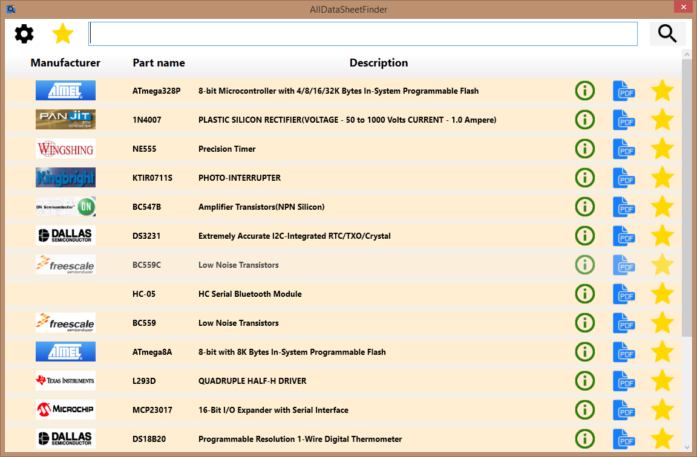
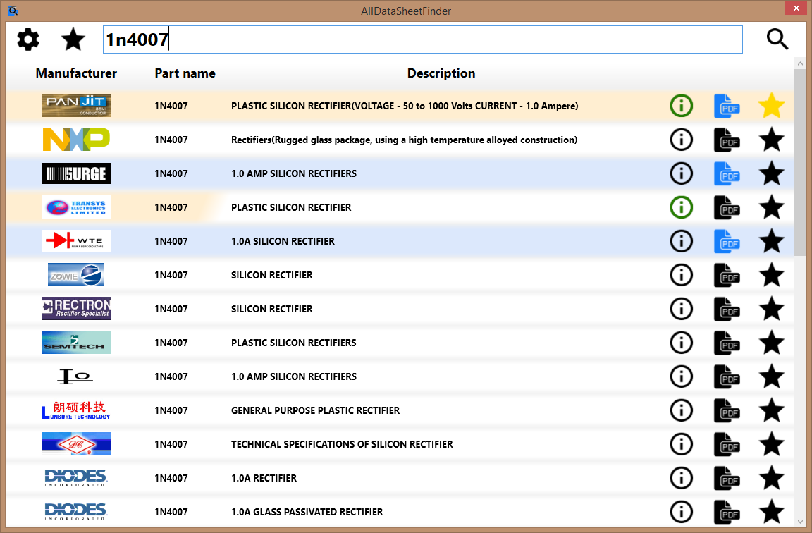

AllDataSheetFinder is an utility for finding, downloading and organizing datasheets from alldatasheet.com.
Application have also ability of organizing own datasheets - not downloaded from alldatasheet.com.

Once you download datasheet, it is stored in cache and can be deleted when cache limit exceeds. You can add it to favourites to prevent from removing.
Manufacturers logos are downloaded only when they are needed and stored locally.

Need .NET Framework 4.5 and any PDF browser to run properly.

All data is stored in AppData\Local\AllDataSheetFinder.

Screenshots:

